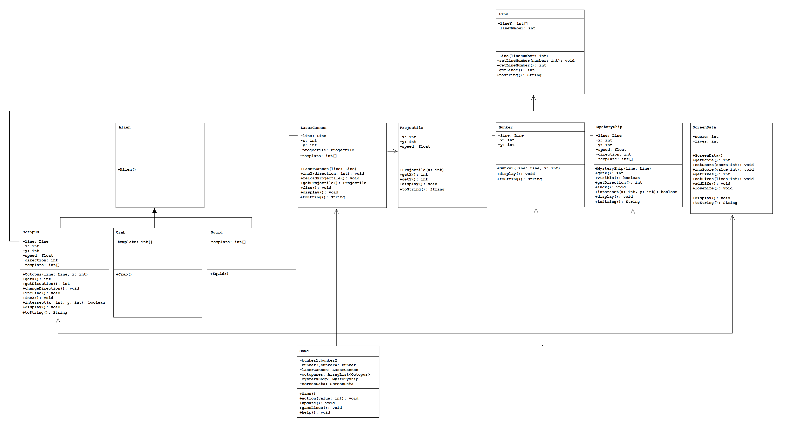
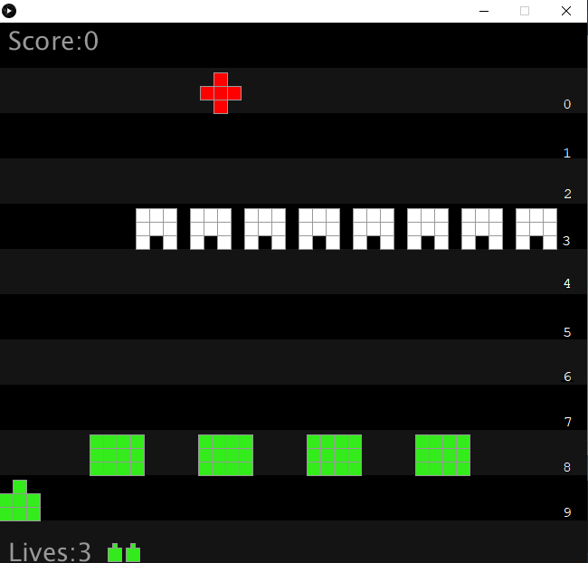
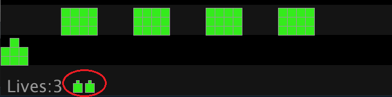
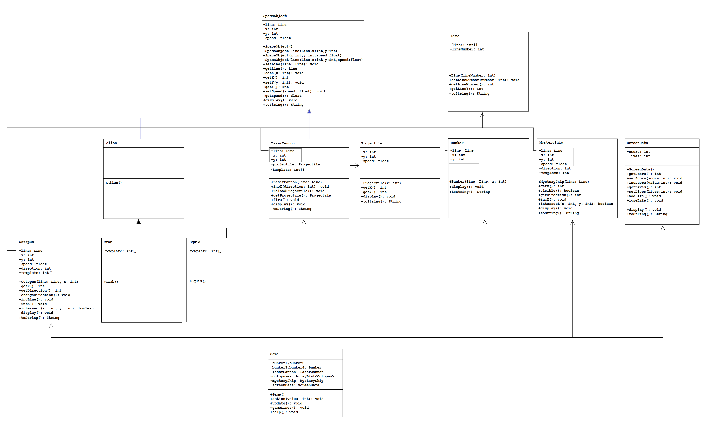

# Assignment 4 - Space Invaders

## Contents

- [Part 1](#part-1--screendata-arraylist-etc) [33%]
- [Part 2](#part-2---spaceobject-abstract-class) [27%]
- [Part 3](#part-3---invalidlinenumberexception) [9%]
- [Part 4](#part-4--interface-blockable) [9%]
- [Part 5](#part-5--crab-squid-scores-and-misses) [22%]
<!-- - [Part 6]() [%] -->

## Submission Details

The deadline for electronic submissions is noon Friday 12th December 2025.  Submit your code via the link on BlackBoard.

Submit your [Assignment Cover Sheet](resources/2025OOPa4CACoverSheet.docx?raw=true) during any lecture before the end of semester.


**A note on plagiarism and cheating**

If any of the code submitted by you is deemed copied from or by someone else it will be formally 
reported to the Head of School of Science and a Disciplinary Committee will be convened to deal with this issue.  You do not want that to happen!!

Never copy code from someone else or another source. Never give your code to someone else. Keep your
code safely in your own possession. Plagiarism and cheating are very serious academic offenses
with serious consequences for your future academic studies and work opportunities. Under
current guidelines all students involved in plagiarism or cheating must be reported to the Head
of School where a Disciplinary Committee will deal with the issue.


## Introduction

Note: For each part you should have separate folders (``siPart1``, ``siPart2``, etc). 
Some of the classes you create in one part may be copied into another (and perhaps modified for the purposes of that part).


## Part 1 – ScreenData, ArrayList, etc

Get the project folder ``siPart1`` [here](resources/siPart1.zip). 

**Follow the instructions below precisely**.  Any deviation from this will mean you will lose marks.

This class diagram shows the structure of this part of the assignment when completed.



Run the Space Invaders game.  



You'll see a *LaserCannon* at the bottom of the screen, an alien *Octopus* moving across the screen and perhaps a *MysteryShip* moving across the top of the screen.  Take time to **examine and understand this code thoroughly**.  


1.	Examine the ``ScreenData`` class in the diagram shown above.  It contains:

	-	2 private instance variables - ``score`` and ``lives``
	-	a constructor that initialises those variables
	-	7 getter, setter and incrementer methods 
	-	a ``display()`` method
	-	a ``toString()`` method that should return data in this format - [ScreenData:score=0;lives=3]

	a.	Write the missing code for the getters, setters, incrementers, ``toString()`` and ``display()``.

	Test your solution by uncommenting the following tester code in the project `setup()` method:

	```java
    ScreenData screenData = new ScreenData();
    println(screenData);
    screenData.  setScore(100);
    screenData.incScore(10);
    println("score="+screenData.getScore());
    screenData.setLives(3);
    screenData.addLife();
    screenData.addLife();
    screenData.loseLife();
    println("lives="+screenData.getLives());
    println(screenData);

	```

	It should print:

	```java
    [ScreenData:score=0;lives=3]
    score=110
    lives=4
    [ScreenData:score=110;lives=4]

	```

	Make sure it prints this using the tester code provided.  Marks are lost if you don't pay attention to detail.

1.	Provide the appropriate ``toString()`` methods shown for the other classes in the diagram.  The following are examples of the output expected:

	```
	[Bunker:line=[Line:lineNumber=8];x=100;y=450]
	[LaserCannon:line=[Line:lineNumber=9];x=0;y=500]
	[Octopus:line=[Line:lineNumber=3];x=0;y=200;speed=1.0;direction=1]
	[MysteryShip:line=[Line:lineNumber=0];x=-45;y=50;speed=2.0;direction=1]
	[Projectile:x=0;y=575;speed=16.0]
	[Line:lineNumber=3]

	```

	Again, pay attention to detail shown here.

1.  In the game so far there is only one alien (i.e. octupus) being displayed. We'll modify the ``Game`` class so an arraylist of 8 aliens can be displayed in a line.  We will:
    -   create an arraylist of octopus objects
    -   add 8 octopus objects to the arraylist
    -   display the octopuses
    -   check for octopus in the arraylist colliding with a projectile

    a.	First, comment out (remove) the octopus object *declaration* and add an arraylist *declaration* like this:

    ```java
    //private Octopus octopus;
    private ArrayList<Octopus> octopuses;

    ```

    b.   Comment out the code that creates the single octopus and add code to *create* the ``octopuses`` arraylist 

    c.   Uncomment the code to add 8 octopus objects to the arraylist ``octopuses``
    
	d.   Comment out the code that displays the single octopus and add code that displays all octopus objects (use an enhanced for loop)
    
	e.   Update the code that checks for projectile collisions with the single octopus to check for collisions for all octopus objects in the arraylist.

    When completed you should have 8 octopus aliens appearing in the game.

    f.   When a projectile collides with an octopus remove the octopus from the arraylist using code like this:

    ```java
    octopuses.remove(o);
    ```

1.  You'll have noticed that if you miss when firing a projectile you cannot fire another projectile. Find the label *Part 1 (reload)* in the ``Game`` class and at this location in the code reload the spaceship projectile only when a missed projectile goes beyond the top of the screen

1.  When a projectile collides with an octopus, briefly change the background color of the screen to green.  You should see a green flashing at the moment alien is shot/disappears.

1.  Previously, in the ``ScreenData`` class we seen the ``lives`` variable set to 3 using ``Game.INITIAL_LIVES``.
    In the ``ScreenData`` method ``display()`` write the code to draw the correct number of miniture laser cannons as shown here for 3 lives:

    

	Also, make sure you are displaying the correct text for the Score and Lives.

1.	Modify the code so when any one alien reaches the edge of the screen, it and all aliens should change direction.  Add your code solution immediately below the code that currently displays the aliens.  Use the method ``changeDirection()`` in ``Octupus`` to change direction:

	```java
	public void changeDirection()
  	{
    	// your code solution here
	}
	```

See video [here](https://lyitbb.blackboard.com/bbcswebdav/xid-6756380_1) for an demo of how Part 1 should look when done.


## Part 2 - SpaceObject abstract class

Only begin this part when you have completed or attempted all you can of *Part 1*.  

Make a copy of your ``siPart1`` project folder, paste and rename it ``siPart2``.  Use ``siPart2`` for this part of the assignment.  You will need to rename the tester program for this part to ``siPart2``.

1.	Create a new class called ``SpaceObject`` as shown in this class diagram:

	

	It contains:

	-	4 private instance variables - ``Line``, ``x``, ``y`` and ``speed``
	-	a default constructor that initialises those variables:
		```java
		this.line=new Line(0);
		this.x=0;
		this.y=0;
		this.speed=1.0;
		```

	-	an overloaded constructor that initialises those variables with specific values passed as arguments
	-	8 getter and setter methods 
	-	a ``toString()`` method that returns using this format:
	
		```
		[SpaceObject:line=[Line:lineNumber=1];x=0;y=0;speed=1.0]
		```

	a.	Write the missing code for the constructors, getters, setters and ``toString()``. 

	b.	Test your solution by uncommenting the following tester code in the project `setup()` method:

	```java
	println();
	println();
	SpaceObject spaceObject = new SpaceObject();
	println(spaceObject);
	spaceObject.setX(100);
	println("x="+spaceObject.getX());
	spaceObject.setY(200);
	println("y="+spaceObject.getY());
	spaceObject.setSpeed(2.0);
	println("speed="+spaceObject.getSpeed());
	println(spaceObject);

	```

	It should print:

	```java
	[SpaceObject:line=[Line:lineNumber=0];x=0;y=0;speed=1.0]
	x=100
	y=200
	speed=2.0
	[SpaceObject:line=[Line:lineNumber=0];x=100;y=200;speed=2.0]

	```

	Make sure it prints this using the tester code provided.  Again, pay attention to the detail.

1.	Make the ``SpaceObject`` class ``abstract``.  Some code in the project ``setup()`` method will need to be commented out again.

1.	Add the abstract method ``display()`` to ``SpaceObject``:

	```java
	public abstract void display();

	```

1.	``SpaceObject`` now provides one class for the instance variables - ``line``, ``x``, ``y`` and ``speed`` and it's various methods.  Have the classes in the project that use these variables **inherit** them from ``SpaceObject``.  This includes the classes - ``Alien``, ``Bunker``, ``LaserCannon``, ``MysteryShip``, and ``Projectile``.

1.	Identify and remove all *shadow instance variables* and *shadow instance methods* from these subclasses.  Remove them from the ``Octopus`` class too.  

	For example, in the ``Bunker`` class comment out the class variables `line`, `x` and `y`:
	```java
	//private Line line;
  	//private int x;
  	//private int y;
	```

	These changes will cause lots of compilation errors in your subclasses now.  Update each of the appropriate subclasses one at a time and fix these errors.  Be careful!

	When finished there should be no shadow instance variables or methods in any subclass of ``SpaceObject``.  Test the game still works.

1.	In the constructors for the classes ``Bunker``, ``LaserCannon``, ``MysteryShip``, ``Projectile`` and ``Octopus`` use the appropriate overloaded constructor from ``SpaceObject`` to initialise the class instance variables.

1.	Modify the code so when any alien reaches the edge of the screen, it and all aliens should change direction AND move to the next line.  Use the method ``incLine()`` in ``Octupus`` to move to next line:

	```java
	public void incLine()
  	{
    	// your code solution here
	}
	```

1.	Modify the code to check for projectile collisions with the mystery ship. If a mystery ship is hit by a projectile:
	-	briefly change the background colour to red
	-	remove it
	-	reload the laser cannon projectile


See video [here](https://lyitbb.blackboard.com/bbcswebdav/xid-6756382_1) for an example of how Part 2 should run when done.


## Part 3 - InvalidLineNumberException

Only begin this part when you have completed or attempted all you can of *Part 2*.  

Make a copy of your ``siPart2`` project folder, paste and rename it ``siPart3``.  Use ``siPart3`` for this part of the assignment.  You will need to rename the tester program for this part to ``siPart3``.

1.	Create a class called ``InvalidLineNumberException``.  See the Java Doc file [here](oop/2025/a4/doc/InvalidLineException.html).  **You MUST create the class exactly as required in the Java documentation given**.  Pay attention to inheritance, constructors and methods in this class.

1.	You may (or may not) have noticed that the space objects are placed in lanes numbered 0 to 9.

	Modify only the constructor in ``Line`` to throw an ``InvalidLineNumberException`` if an invalid line number is passed to the constructor.  Throw this exception if the line number is less than 1 or greater than 9.  
	
	These changes will cause errors in the ``Game`` and ``Line`` classes.  Fix them by using appropriate ``try..catch`` statements using the new exception.  Print the message returned by the exception class **and** stop the program by using the ``exit()`` method.  Therefore, if an invalid lane number is given for any game object the game/program should stop.

See video [here](https://lyitbb.blackboard.com/bbcswebdav/xid-6756383_1) for an example of how Part 3 should run when done.


## Part 4 – Interface ``Blockable``

Only begin this part when you have completed or attempted all you can of Part 3.

Make a copy of your ``siPart3`` project folder, paste and rename it ``siPart4``. Use ``siPart4`` for this part of the assignment. You will need to rename the tester program for this part to ``siPart4``.

1.	Modify the code to use an arraylist to store and display all the bunkers.

1.	Create an interface called ``Blockable`` See the Java Doc file [here](oop/2025/a4/doc/Blockable.html)

1.	Provide the appropriate implementation of ``Blockable`` in the ``Bunker`` class.

	The ``blocksProjectile()`` method should determine if the projectile collides with the bunker. 
	You've done this before for collisions with the octopus and mystery ship.

	You will need to update the code in ``Game`` to use the new ``blocksProjectile()`` method every time after displaying the projectile. If a collision is detected with a bunker make the projectile disappear. 

	This code solution will require a good amount of independent work.

See video [here](https://lyitbb.blackboard.com/bbcswebdav/xid-6756381_1) for an example of how Part 4 should run when done.


## Part 5 – Crab, Squid, Scores and Misses

Only begin this part when you have completed or attempted all you can of Part 4.

Make a copy of your ``siPart4`` project folder, paste and rename it ``siPart5``. Use ``siPart5`` for this part of the assignment. You will need to rename the tester program for this part to ``siPart5``.


1.	Earlier we seen the [classes](images/classDiagram1.png) ``Crab`` and ``Squid`` are subclasses of ``Alien``.  These two classes will be used to implement two more types of alien in the game.  Using ``Octupus`` as a guide, complete the code needed to implement both incomplete classes.  

1.	When both classes above are completed comment out (remove) the ``octopuses`` arraylist declaration and add an new generic ``aliens`` arraylist declaration like this:

	```java	
	//private ArrayList<Octopus> octopuses;
	private ArrayList<Alien> aliens;

	```

	This new arraylist will be used to store all 3 types of alien objects - ``Octopus``, ``Crab`` and ``Squid``.  
	
	You will need to comment out (remove) the code that created octopus objects and create all the aliens using this code:

	```java
	for (int i=0; i<MIN_ALIENS_IN_LINE; i++){
		aliens.add(new Octopus(new Line(3),ALIEN_X[i]));
		// add Crabs 
		// add Squids 
	}
	
	```

	This change will require significant updates to the code in the ``Game`` class. Diligently make those updates to use the ``aliens`` arraylist from now on.

1.	You need to update and display a score whilst playing the game.  Scores are awarded for shooting aliens and mystery ship:

	| Event              | Score |
	| ------------------ | ----- |
	| Shoot Octopus      |  20   |
	| Shoot Crab         |  30   |
	| Shoot Squid        |  40   |
	| Shoot Mystery Ship | 100   |

	You MUST use the ``ScreenData`` class ``display()`` method to display score.

1.	Update the screen display to show a new stat called *Misses*.  You must count every time you fire a projectile and miss.  
	You MUST use the ``ScreenData`` class to keep a record of misses and display the appropriate value.

1.	You will lose one life in the game each time you miss a multiple of 5.  So you'll lose a life after 5, 10, and 15 misses.
	Modify the code to implement this feature.  The game should end immediately when you lose all three lives.

1.	Finally, the game should end immediately if any of the aliens reach the same line the laser cannon is at.  

See video [here](https://lyitbb.blackboard.com/bbcswebdav/xid-6756379_1) for an example of how Part 5 should run when done.

<!-- ## Part 6 – Sound -->