# Sorting & Searching

## Contents

- [Sorting Arrays](#sorting-arrays)
- [Searching Arrays](#searching-arrays)


## Sorting Arrays

Sorting is the process of arranging elements in a data structure such as an array or arraylist in numeric or alphabetical order.

We've already seen the ``Collections.sort()`` method available to us to sort arraylists.  In this section we'll examine two algorithms that do the actual sorting.

### Selection Sort

In a Selection Sort, we select the largest element in the array and place it at the end of the array. Then we select the next-largest element and put it in the next-to-last position in the array, and so on. 

To do this, we consider the unsorted portion of the array as a *subarray*.  We repeatedly select the largest value in the current subarray and move it to the end of the subarray, then consider a new subarray by eliminating the elements that are in their sorted locations. We continue until the subarray has only one element. At that time, the array is sorted.

To sort an array with *n* elements in ascending order:

1.	Consider the *n* elements as a subarray with *m = n* elements
2.	Find the index of the largest value in this subarray.
3.	Swap the values of the element with the largest value and the element in the last position in the subarray.
4.	Consider a new subarray of *m = m - 1* elements by eliminating the last element in the previous subarray
5.	Repeat steps 2 through 4 until *m = 1*.


In the beginning, the entire array is the unsorted subarray:

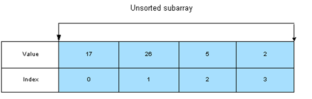

We swap the largest element with the last element:

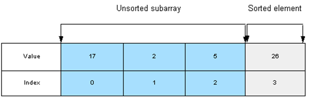

Again, we swap the largest and last elements:

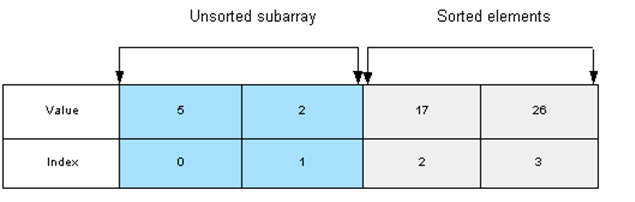

When there is only 1 unsorted element, the array is completely sorted:

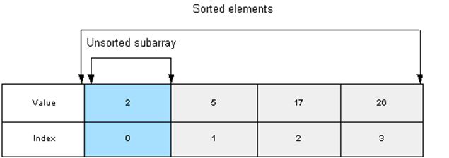


### Swapping Values

To swap two values, we define a temporary variable to hold the value of one of the elements, so that we don't lose that value during the swap. 

To swap elements ``a`` and ``b``:

1.	define a temporary variable, ``temp``.
2.	assign element ``a`` to ``temp``.
3.	assign element ``b`` to element ``a``.
4.	assign ``temp`` to element ``b``.

This code will swap elements 3 and 6 in an int array named ``array``:

```java
int temp;             // step 1
temp = array[3];	  // step 2
array[3] = array[6];  // step 3
array[6] = temp;      // step 4 

```


### Bubble Sort

The basic approach to a Bubble Sort is to make multiple passes through the array. 

In each pass, we compare adjacent elements. If any two adjacent elements are out of order, we put them in order by swapping their values. 

At the end of each pass, one more element has "bubbled" up to its correct position.

We keep making passes through the array until all the elements are in order.

To sort an array of *n* elements in ascending order, we use a nested loop:

-	The outer loop executes *n – 1* times

-	For each iteration of the outer loop, the inner loop steps through all the unsorted elements of the array and does the following:
	-	Compares the current element with the next element in the array.
	-	If the next element is smaller, it swaps the two elements.


Bubble Sort pseudocode:

```java
for i = 0 to last array index – 1 by 1
{
 for j = 0 to ( last array index – i - 1 ) by 1
 {
	if ( 2 consecutive elements are not in order )
	  swap the elements
 }
}

```

At the beginning, the array is:

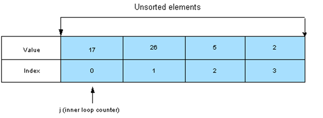

We compare elements 0 (17) and 1 (26) and find they are in the correct order, so we do not swap.

The inner loop counter is incremented to the next element:

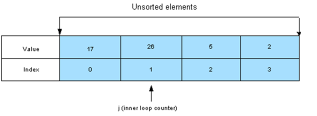

We compare elements 1 (26) and 2 (5), and find they are not in the correct order, so we swap them.

The inner loop counter is incremented to the next element:

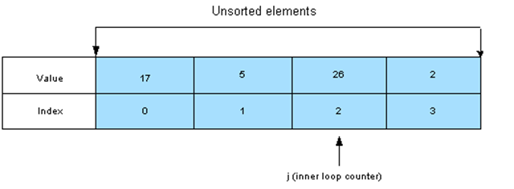

We compare elements 2 (26) and 3 (2), and find they are not in the correct order, so we swap them.

The inner loop completes, which ends our first pass through the array

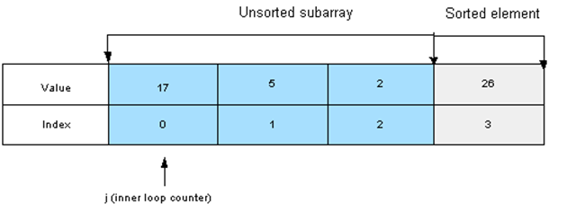

The largest value in the array (26) has bubbled up to its correct position.

We begin the second pass through the array. We compare elements 0 (17) and 1 (5) and swap them

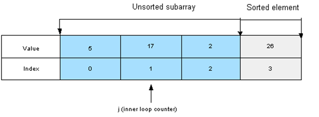

We compare elements 1 (17) and 2 (2) and swap.

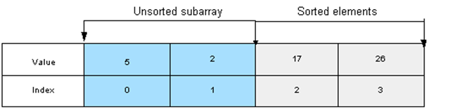

This ends the second pass through the array. The second-largest element (17) has bubbled up to its correct position

We begin the last pass through the array.

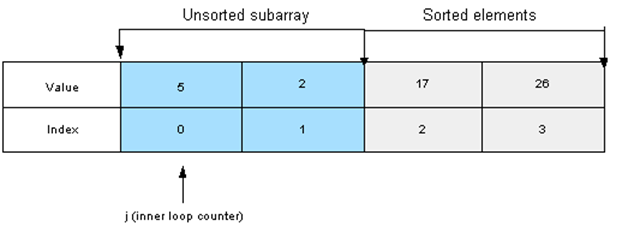

We compare element 0 (5) with element 1 (2) and swap them. 

The third-largest value (5) has bubbled up to its correct position.

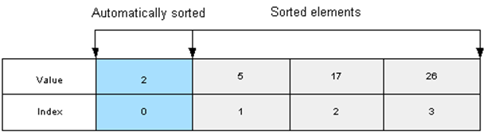

Only one element remains, so the array is now sorted.

Bubble Sort code:

```java
for ( int i = 0; i < array.length - 1; i++ ) 
  {
	  for ( int j = 0; j < array.length – i - 1; j++ )
	  {
		 if ( array[j] > array[j + 1] )
		 {
		     // swap the elements
		     int temp = array[j + 1];
		     array[j + 1] = array[j];
		     array[j] = temp;
       }
	  } // end inner for loop          
  } // end outer for loop

```


### Sorting Arrays of Objects

In arrays of objects, the array elements are object references. Thus, to sort an array of objects, we need to sort the data of the objects. Usually, one of the instance variables of the object acts as a sort key.  For example, in an email object, the sort key might be the date received.  Code to sort an array of ``Auto`` objects using ``model`` as the sort key:

```java
for (int i = 0; i < array.length - 1; i++) 
{    
	for (int j = 0; j < array.length - i - 1; j++ )
	{
		if ( array[j].getModel().compareTo(array[j+1].getModel()) > 0 )
		{
			Auto temp = array[j + 1];
			array[j + 1] = array[j];
			array[j] = temp;
		} end if statement
	} // end inner for loop
} // end outer for loop

```

## Searching Arrays

### Sequential Search

A Sequential Search can be used to determine if a specific value (the search key) is in an array.

Approach is to start with the first element and compare each element  to the search key:
-	If found, return the index of the element that contains the search key.
-	If not found, return  -1.

Because -1 is not a valid index, this is a good return value to indicate that the search key was not found in the array.

Code to Perform a Sequential Search:

```java
public int searchArray(int key)
{
	for (int i = 0; i < array.length; i++)
	{
		if (array[i] == key)
			return i;
	} 
	return -1;
}

```

Note: this assumes that you have an array called ``array`` in the same class as this method.

When an array's elements are in random order, our Sequential Search method needs to look at every element in the array before discovering that the search key is not in the array. This is inefficient; the larger the array, the more inefficient a Sequential Search becomes.

We can simplify the search by sorting the array. Once the array is sorted, we can use various search algorithms to speed up a search.

### Binary Search

A Binary Search is like a "Guess a Number" game.  For example, to guess a number between 1 and 100, we start with 50 (halfway between the beginning number and the end number). If we learn that the number is greater than 50, we immediately know the number is not 1 - 49.   If we learn that the number is less than 50, we immediately know the number is not 51 - 100. 
We keep guessing the number that is in the middle of the remaining numbers (eliminating half the remaining numbers) until we find the number.

The "Guess a Number" approach only works if the numbers 1 - 100 are sorted.  To use a Binary Search, the array must be sorted.

Our Binary Search will attempt to find a search key in a sorted array.  If the search key is found, we return the index of the element with that value.  If the search key is not found, we return -1.


**Binary Search Algorithm**

We begin by comparing the middle element of the array and the search key. 

If they are equal, we found the search key and return the index of the middle element.

If the middle element's value is greater than the search key, then the search key cannot be found in elements with higher array indexes. So, we continue our search in the left half of the array.  

If the middle element's value is less than the search key, then the search key cannot be found in elements with lower array indexes. So, we continue our search in the right half of the array.

As we keep searching, the subarray we search keeps shrinking in size. In fact, the size of the subarray we search is cut in half at every iteration.  

If the search key is not in the array, the subarray we search will eventually become empty. At that point, we know that we will not find our search key in the array, and we return –1.  


**Example #1 of a Binary Search**

Let's search for the value 7 in this sorted array:

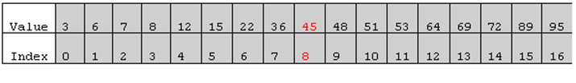

mid        | start         | end
---------- |:-------------:| -----:
8|0|16

The table shows initial values for the middle, start and end of the search subarray.

To begin, we find the index of the middle (``mid``) element, which is 8, and we compare our search key (7) with the value 45.

Because 7 is less than 45, we eliminate all array elements higher than our current middle element and consider elements 0 through 7 the new subarray to search.


mid        | start         | end
---------- |:-------------:| -----:
3|0|7

The index of the ``mid`` element is now 3, so we compare 7 to the value 8:

Because 7 is less than 8, we eliminate all array elements higher than our current ``mid`` element (3) and make elements 0 through 2 the new subarray to search.

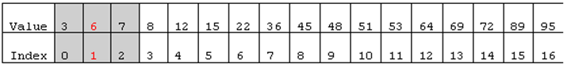

mid        | start         | end
---------- |:-------------:| -----:
1|0|2

The index of the ``mid`` element is now 1, so we compare 7 to the value 6:


Because 7 is greater than 6, we eliminate array elements lower than our current ``mid`` element (1) and make element 2 the new subarray to search.

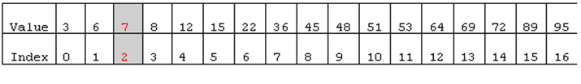

The value of element 2 matches the search key, so our search is successful and we return the index 2.


**Example #2 of a Binary Search**

Let's search for a value **not** in the array, 34.


mid        | start         | end
---------- |:-------------:| -----:
8|0|16

The table shows initial values for the middle, start and end of the search subarray:

To begin, we find the index of the middle (``mid``) element, which is 8, and we compare our search key (34) with the value 45.

Because 34 is less than 45, we eliminate array elements higher than our current ``mid`` element and consider elements 0 through 7 the new subarray to search.

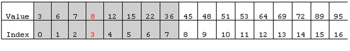

mid        | start         | end
---------- |:-------------:| -----:
3|0|7

The index of the ``mid`` element is now 3, so we compare 34 to the value 8:

Because 34 is greater than 8, we eliminate array elements lower than our current ``mid`` element and consider elements 4 through 7 the new subarray to search

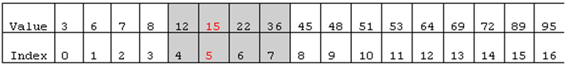

mid        | start         | end
---------- |:-------------:| -----:
5|4|7


The index of the ``mid`` element is now 5, so we compare 34 to the value 15:

Again, we eliminate array elements lower than our current ``mid`` element and make elements 6 and 7 the new subarray to search.

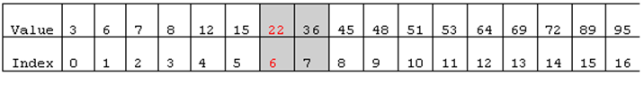

mid        | start         | end
---------- |:-------------:| -----:
6|6|7

The index of the center element is now 6, so we compare 34 to the value 22:

Next, we eliminate array elements lower than our current ``mid`` element and make element 7 the new subarray to search

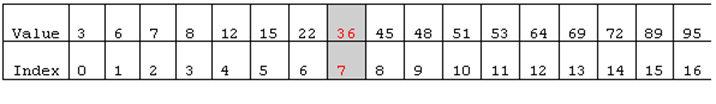

We compare 34 to the value 36, and attempt to eliminate the higher subarray, which leaves an empty subarray.

We have determined that 32 is not in the array. We return -1 to indicate an unsuccessful search.

### Binary Search Code:

```java
int binarySearch(int[] list, int searchItem) 
{ 
  int mid=0; 
  int start=0; 
  int end=list.length-1; 
  boolean found=false; 

  //Loop until found or end of list. 
  while (start <= end && !found) 
  { 
    mid = (start + end) / 2; 
    if (list[mid] == searchItem)
      found = true;
    else 
      if (list[mid] > searchItem) 
        end = mid - 1;
      else 
        start = mid + 1;
  }
  
  if(found) 
    return mid;
  else 
    return(-1);

}

```
