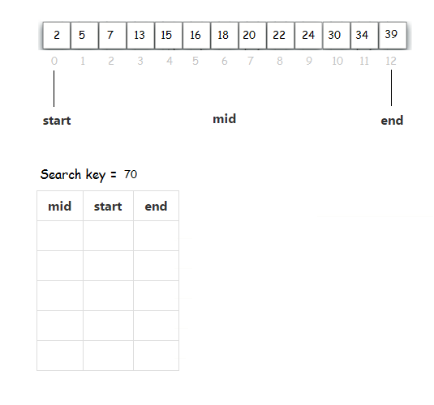

# Java Tutorial #9 - Sorting & Searching

Topics:

-	Sorting Arrays
-	Sorting Circles


## Part 1 - Sorting Arrays

> Make sure you've read the notes [here](/notes/SortingAndSearching.md)

Open and run the program [tut09_01](/code/tutorials/tut09_01/tut09_01.zip). Take a moment to examine all the code and the output.

You'll see the first row of dice is unsorted and the second row is unsorted.  Nothing has been sorted yet.

**Selection Sort**

1.	Find and uncomment the line:

	```java
	selectionSort(nums);

	```

2.	Run the program again and observe the output:

	-	the second row of dice is the sorted version of the first row
	-	it took *n-1* passes to sort the array, where n=6
	-	look carefully at the values printed in the console after each pass


3.	Comment out the line again:

	```java
	//selectionSort(nums);

	```


**Bubble Sort**

1.	Change the values in the ``nums`` array to:

	```java
	int[] nums = {2, 1, 3, 4, 5, 6};

	```

2.	Find and uncomment the line:

	```java
	bubbleSort(nums);

	```

	**Make sure you only have this line uncommented**

3.	Run the program again and observe the output:

	-	the second row of dice again is sorted
	-	again, it took *n-1* passes to sort the array, where n=6
	-	look carefully at the values printed in the console after each pass


4.	Modify the code in ``bubbleSort()`` to sort the dice in descending order.  It's a very simple modification.  Test it works.

5.	Comment out the line again:

	```java
	//bubbleSort(nums);

	```


**Bubble Sort Version 2**

1.	Find and uncomment the line:

	```java
	bubbleSortV2(nums);

	```

	**Make sure you only have this line uncommented**

2.	Run the program again and observe the output:

	-	the second row of dice again is sorted
	-	this time it took **only 2 passes** to sort the array
	-	look carefully at the values printed in the console after each pass
	-	this bubble sort quits early if the array is sorted


## Part 2 - Sorting Circles

Let's attempt to use the ``bubbleSort()`` algorithm method to sort circle objects by their radius values.

1.	Open and run the program [tut09_02](/code/tutorials/tut09_02/tut09_02.zip). 

2.	Notice the numbers within the circles indicates the sequence the circles are displayed.  For now they are displayed in the order they are retrieved from the array ``circles``.

3.	Provide the appropriate missing code within ``bubbleSort()`` to sort the ``circles`` array by radius.

	Test your code works.  


## Part 3 - Sorting Circles with ``CompareTo()``

In your solution to Part 2, did you use the ``compareTo()`` method to compare circles?

If yes, good work Java Jedi.  Skip Part 3.

If not, download the program [tut09_03](/code/tutorials/tut09_03/tut09_03.zip) and use the ``compareTo()`` method in your ``bubbleSort()`` method.  You'll need to make some modifications to an existing class file.


## Part 4 - Searching Arrays

> Make sure you've read the notes [here](/notes/SortingAndSearching.md#searching-arrays)

Open and run the program [tut09_04](/code/tutorials/tut09_04/tut09_04.zip). Take a moment to examine all the code.

1.	To search the ``nums`` array for the value 7 using the Sequential Search uncomment the line:

	```java
	println(Searcher.sequentialSearch(nums, 7));

	```

	It should print the array index position where 7 is found

2.	Modify the line above to search the ``nums`` array for the value 40 (which doesn't exist).  It should print ``-1`` which means it couldn't be found

3.	To search the ``nums`` array for the value 7 using the Binary Search uncomment the line:

	```java
	println(Searcher.binarySearch(nums,7));	

	```


## Part 5 - Binary Search

1.	For the following array determine the indices that a Binary Search will look at when searching for the search-key 70.  

	
	
	Your answer should complete the values of the variables ``start``, ``mid``, ``end`` in the empty table given.


<!-- 
## Exam Revision

Attempt the Week 10 & 11 exam question(s) [here](../notes/Examinations.md).


 -->
